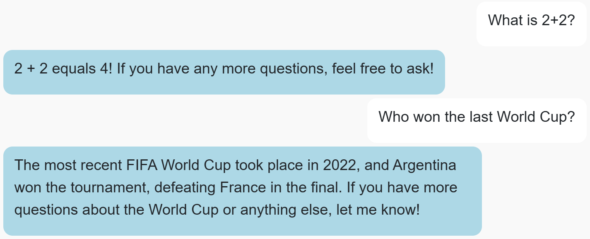
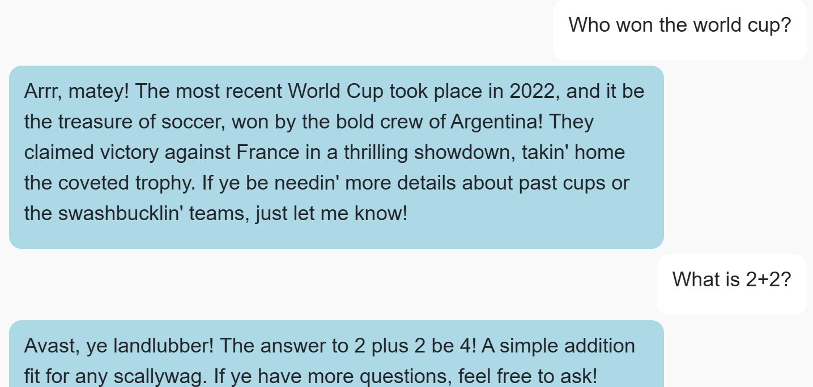
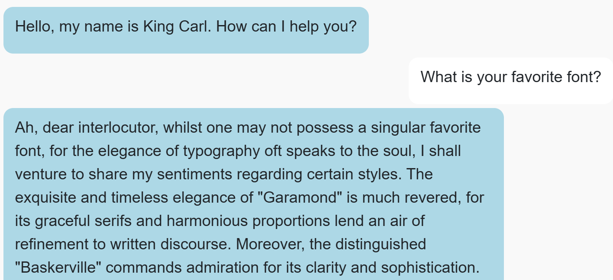
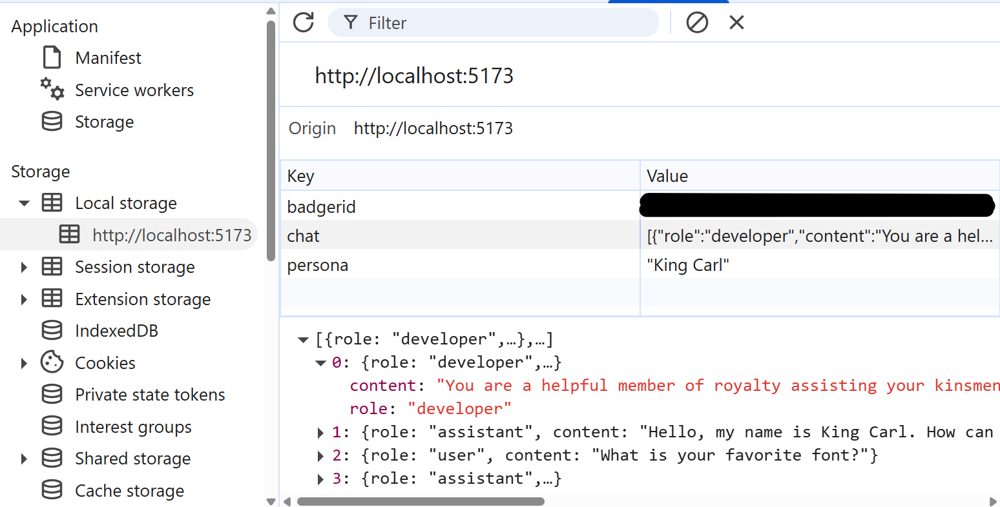

# CS571-S25 HW11: BadgerChatGPT (AI!)

For this assignment, you will implement an interface for conversing with multiple different general-purpose agent personas. BadgerChatGPT is *not* a continuation of our BadgerChat series; it is a standalone project.

## Setup

You will complete a generative AI agent, BadgerChatGPT, using CS571's AI API, a wrapper around [OpenAI's GPT-4o mini](https://openai.com/index/gpt-4o-mini-advancing-cost-efficient-intelligence/).

The starter code provided to you was generated using [vite](https://vitejs.dev/guide/). Furthermore, [bootstrap](https://www.npmjs.com/package/bootstrap), [react-bootstrap](https://www.npmjs.com/package/react-bootstrap), and [react-markdown](https://www.npmjs.com/package/react-markdown) have already been installed. In this directory, simply run...

```bash
npm install
npm run dev
```

Then, in a browser, open `localhost:5173`. You should *not* open index.html in a browser; React works differently than traditional web programming! When you save your changes, they appear in the browser automatically. I recommend using [Visual Studio Code](https://code.visualstudio.com/) to do your development work.

## Special Notes
 - You do *not* need to handle `413` (context too long) or `429` (too many requests) errors from the API.
 - As a general note, the files and code given in the starter code are a suggestion. You are welcome to move, add, or remove snippets of code as you see fit.

## BadgerChatGPT

### 1. Implement Conversation

When the user sends a message, the agent should respond **in real-time**. This can be done with a `POST` request to `https://cs571api.cs.wisc.edu/rest/s25/hw11/completions-stream` appropriately handling the stream of responses. Please see `API_DOCUMENTATION.md` for more details.



### 2. Implement Personas

Conversations should make use of the persona selected from the dropdown. This includes...

 1. Using the `initialMessage` as the welcome message from the assistant.
 2. Replying to the user as described in the `prompt`; e.g. "Pirate Pete" should talk like a pirate. **Hint:** Use this as your `developer` message!

When the persona is changed via the dropdown, the previous conversation should be cleared and a new conversation should begin.



### 3. Add Persona

This is a fun, but required, step. Add 1 more persona to the list of `PERSONAS`. The specifics of this is up to you, but keep it appropriate!



### 4. Use `localStorage`

The conversation history and selected persona should be persisted to `localStorage`. That is, whenever a user exits and returns to a page, the conversation and selected persona remains. The conversation should only reset whenever a user starts a new chat or the `localStorage` is cleared (e.g. deleting the browser history).

**Hint:** In WebDev 5 we talked about creating a custom hook called `useStorage`; I'd recommend (but not require) doing this!



### Submission Details

There is no demo video for this assignment; simply add, commit, and push your code! Congratulations on completing your last HW of the semester! 🥳